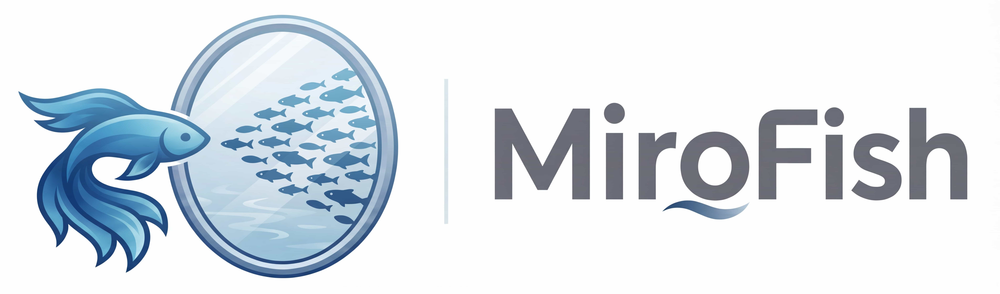
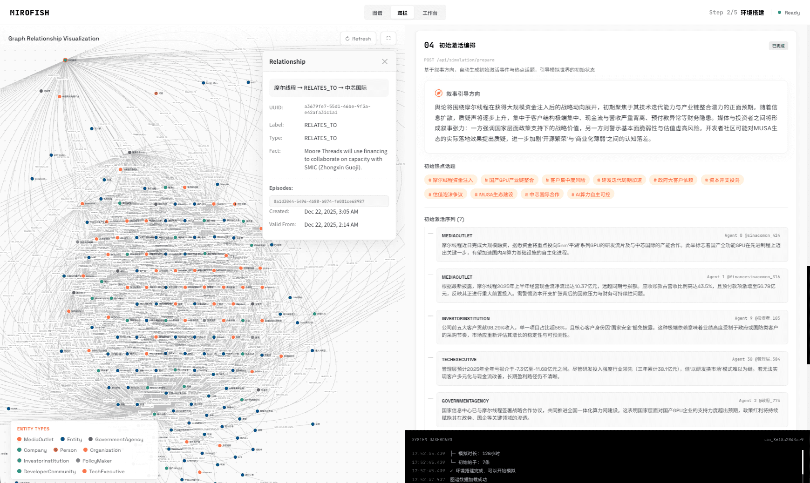

<div align="center">



Công cụ Trí tuệ Bầy đàn Đơn giản và Đa năng, Dự đoán Mọi thứ
</br>
<em>Lấy cảm hứng từ dự án <a href="https://github.com/666ghj/MiroFish">MiroFish</a> gốc — phiên bản Việt hóa</em>

[](https://hub.docker.com/)

[Tiếng Việt](./README.md) | [English](./README-EN.md)

</div>

## ⚡ Tổng quan dự án

**MiroFish Việt Hóa** là phiên bản Việt hóa của công cụ dự đoán AI thế hệ mới dựa trên công nghệ đa tác tử (multi-agent). Dự án lấy cảm hứng từ [MiroFish](https://github.com/666ghj/MiroFish) — một dự án mã nguồn mở được hỗ trợ bởi Shanda Group.

Bằng cách trích xuất thông tin hạt giống từ thế giới thực (như tin tức nóng, dự thảo chính sách, tín hiệu tài chính), hệ thống tự động xây dựng một thế giới số song song có độ trung thực cao. Trong không gian này, hàng nghìn tác tử thông minh với tính cách độc lập, trí nhớ dài hạn và logic hành vi tự do tương tác và tiến hóa xã hội. Bạn có thể can thiệp biến số động từ "góc nhìn thượng đế" để suy luận chính xác xu hướng tương lai — **diễn tập tương lai trong hộp cát số, chiến thắng quyết định sau trăm lần mô phỏng**.

> Bạn chỉ cần: Tải lên tài liệu hạt giống (báo cáo phân tích dữ liệu hoặc câu chuyện tiểu thuyết thú vị) và mô tả nhu cầu dự đoán bằng ngôn ngữ tự nhiên</br>
> MiroFish sẽ trả về: Một báo cáo dự đoán chi tiết và một thế giới số tương tác sâu có độ trung thực cao

### Tầm nhìn

MiroFish Việt Hóa hướng tới việc xây dựng bản sao trí tuệ bầy đàn phản ánh thực tế. Bằng cách nắm bắt sự nổi lên tập thể từ các tương tác cá nhân, phá vỡ giới hạn của dự đoán truyền thống:

- **Ở tầm vĩ mô**: Phòng thí nghiệm diễn tập cho nhà ra quyết định, cho phép thử nghiệm chính sách và truyền thông với rủi ro bằng không
- **Ở tầm vi mô**: Hộp cát sáng tạo cho người dùng cá nhân — dù là suy luận kết thúc tiểu thuyết hay khám phá các kịch bản tưởng tượng, mọi thứ đều thú vị và dễ tiếp cận

Từ dự đoán nghiêm túc đến mô phỏng giải trí, mỗi câu hỏi "nếu như" đều có thể nhìn thấy kết quả.

## 📸 Ảnh chụp hệ thống

<div align="center">
<table>
<tr>
<td></td>
<td></td>
</tr>
<tr>
<td></td>
<td></td>
</tr>
<tr>
<td></td>
<td></td>
</tr>
</table>
</div>

## 🔄 Quy trình hoạt động

1. **Xây dựng đồ thị**: Trích xuất hạt giống thực tế & Tiêm trí nhớ cá nhân/tập thể & Xây dựng GraphRAG
2. **Thiết lập môi trường**: Trích xuất quan hệ thực thể & Tạo hồ sơ nhân vật & Tác tử cấu hình tiêm tham số mô phỏng
3. **Bắt đầu mô phỏng**: Mô phỏng song song đa nền tảng & Tự động phân tích nhu cầu dự đoán & Cập nhật trí nhớ thời gian động
4. **Tạo báo cáo**: ReportAgent sở hữu bộ công cụ phong phú để tương tác sâu với môi trường sau mô phỏng
5. **Tương tác sâu**: Trò chuyện với bất kỳ tác tử nào trong thế giới mô phỏng & Tương tác với ReportAgent

## 🚀 Bắt đầu nhanh

### Cách 1: Triển khai từ mã nguồn (Khuyến nghị)

#### Yêu cầu trước

| Công cụ | Phiên bản | Mô tả | Kiểm tra |
|---------|-----------|-------|----------|
| **Node.js** | 18+ | Môi trường chạy frontend, bao gồm npm | `node -v` |
| **Python** | ≥3.11, ≤3.12 | Môi trường chạy backend | `python --version` |
| **uv** | Mới nhất | Trình quản lý gói Python | `uv --version` |

#### 1. Cấu hình biến môi trường

```bash
# Sao chép tệp cấu hình mẫu
cp .env.example .env

# Chỉnh sửa tệp .env, điền các khóa API cần thiết
```

**Biến môi trường bắt buộc:**

```env
# Cấu hình LLM API (hỗ trợ bất kỳ LLM API nào theo định dạng OpenAI SDK)
# Khuyến nghị sử dụng mô hình qwen-plus trên nền tảng Alibaba Bailian: https://bailian.console.aliyun.com/
# Lưu ý: tiêu hao tài nguyên lớn, nên thử mô phỏng dưới 40 vòng trước
LLM_API_KEY=your_api_key
LLM_BASE_URL=https://dashscope.aliyuncs.com/compatible-mode/v1
LLM_MODEL_NAME=qwen-plus

# Cấu hình Zep Cloud
# Hạn mức miễn phí hàng tháng đủ cho sử dụng cơ bản: https://app.getzep.com/
ZEP_API_KEY=your_zep_api_key
```

#### 2. Cài đặt phụ thuộc

```bash
# Cài đặt tất cả phụ thuộc một lần (thư mục gốc + frontend + backend)
npm run setup:all
```

Hoặc cài đặt từng bước:

```bash
# Cài đặt phụ thuộc Node (thư mục gốc + frontend)
npm run setup

# Cài đặt phụ thuộc Python (backend, tự động tạo môi trường ảo)
npm run setup:backend
```

#### 3. Khởi động dịch vụ

```bash
# Khởi động đồng thời frontend và backend (chạy tại thư mục gốc dự án)
npm run dev
```

**Địa chỉ dịch vụ:**
- Frontend: `http://localhost:3000`
- Backend API: `http://localhost:5001`

**Khởi động riêng lẻ:**

```bash
npm run backend   # Chỉ khởi động backend
npm run frontend  # Chỉ khởi động frontend
```

### Cách 2: Triển khai bằng Docker

```bash
# 1. Cấu hình biến môi trường (giống triển khai từ mã nguồn)
cp .env.example .env

# 2. Kéo image và khởi động
docker compose up -d
```

Mặc định đọc tệp `.env` từ thư mục gốc, ánh xạ cổng `3000 (frontend) / 5001 (backend)`

> Trong `docker-compose.yml` đã cung cấp địa chỉ mirror tăng tốc qua chú thích, có thể thay thế khi cần.

## 📄 Lời cảm ơn

Dự án này được lấy cảm hứng từ **[MiroFish](https://github.com/666ghj/MiroFish)** — một dự án mã nguồn mở của đội ngũ MiroFish, được hỗ trợ chiến lược và ươm mầm bởi Shanda Group.

Công cụ mô phỏng của MiroFish được vận hành bởi **[OASIS (Open Agent Social Interaction Simulations)](https://github.com/camel-ai/oasis)**. Xin chân thành cảm ơn đội ngũ CAMEL-AI vì những đóng góp mã nguồn mở!
